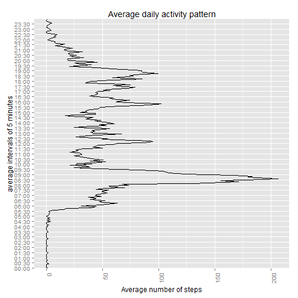

# Reproducible Research: Peer Assessment 1

July 2014 - Javier González Hernández


## Loading and preprocessing the data

Environment setup.

```r
setwd("C:/Users/Jg/RepData_PeerAssessment1")
library(ggplot2)
library(lattice)
```

Loading data and first view.

```r
activity <- read.csv("activity.csv", colClasses=c("numeric", "character", "numeric"), header=T)
head(activity)
```

```
##   steps       date interval
## 1    NA 2012-10-01        0
## 2    NA 2012-10-01        5
## 3    NA 2012-10-01       10
## 4    NA 2012-10-01       15
## 5    NA 2012-10-01       20
## 6    NA 2012-10-01       25
```

Extraction of times from intervals.

```r
intervals_to_times <- sprintf("%04d", activity$interval)
activity$time <- as.factor(gsub("(\\d{2})(\\d{2})","\\1:\\2", intervals_to_times))
head(activity)
```

```
##   steps       date interval  time
## 1    NA 2012-10-01        0 00:00
## 2    NA 2012-10-01        5 00:05
## 3    NA 2012-10-01       10 00:10
## 4    NA 2012-10-01       15 00:15
## 5    NA 2012-10-01       20 00:20
## 6    NA 2012-10-01       25 00:25
```

Preprocesing the data and first approaching plot.

```r
totalStepsByDay <- aggregate(steps ~ date, data=activity, sum, na.rm=TRUE)
head(totalStepsByDay)
```

```
##         date steps
## 1 2012-10-02   126
## 2 2012-10-03 11352
## 3 2012-10-04 12116
## 4 2012-10-05 13294
## 5 2012-10-06 15420
## 6 2012-10-07 11015
```

```r
days <- totalStepsByDay[,1]
steps <- totalStepsByDay[,2]
ggplot(totalStepsByDay) + 
  geom_bar(aes(x=days, y=steps), fill="yellow",color="black", binwidth=5000, stat="identity") +
  coord_flip()
```

 


## What is mean total number of steps taken per day?


```r
hist(totalStepsByDay$steps, main="Total number of steps taken per day", xlab="steps",
     col="yellow")
```

 

Mean and median total number of steps taken per day.

```r
mean(totalStepsByDay$steps)
```

```
## [1] 10766
```

```r
median(totalStepsByDay$steps)
```

```
## [1] 10765
```

Second plot showing the reported mean.

```r
meanStepsByDay <- mean(totalStepsByDay$steps)
ggplot(totalStepsByDay, aes(x=steps)) +  
  geom_histogram(colour="black", fill="yellow", binwidth=5000) +  
  geom_vline(aes(xintercept=meanStepsByDay, color="Mean"), size=1, show_guide=T) +  
  guides(colour=guide_legend(title=NULL)) +
  labs(title="Total number of steps taken per day showing the mean", x="Number of steps", y="Frequency")
```

 

## What is the average daily activity pattern?

Preparing and viewing the data.

```r
meanStepsByInterval <- aggregate(activity$steps ~ activity$time, data=activity, mean,
                                 na.rm=TRUE)
head(meanStepsByInterval)
```

```
##   activity$time activity$steps
## 1         00:00        1.71698
## 2         00:05        0.33962
## 3         00:10        0.13208
## 4         00:15        0.15094
## 5         00:20        0.07547
## 6         00:25        2.09434
```

```r
tail(meanStepsByInterval)
```

```
##     activity$time activity$steps
## 283         23:30         2.6038
## 284         23:35         4.6981
## 285         23:40         3.3019
## 286         23:45         0.6415
## 287         23:50         0.2264
## 288         23:55         1.0755
```

Ploting the data.

```r
averageIntervals <- meanStepsByInterval[,1]
averageSteps <- meanStepsByInterval[,2]
ggplot(meanStepsByInterval) +  
  geom_line(aes(y=averageSteps, x=averageIntervals, group=1)) +
  scale_x_discrete(breaks=averageIntervals[seq(1,288, by=6)]) +
  theme(axis.text.x=element_text(angle=90, hjust=1)) + coord_flip() +
  labs(title="Average daily activity pattern", x="average intervals of 5 minutes",
       y="Average number of steps")
```

 

Interval of 5 minutes that contains the maximum average number of steps.

Maximum average number of steps.

```r
maxSteps <- max(meanStepsByInterval[,2])
c(Maximun_average_number_steps=maxSteps)
```

```
## Maximun_average_number_steps 
##                        206.2
```

Maximum Interval.

```r
maxActivityId <- which(meanStepsByInterval[,2]==maxSteps)
c(Maximun_interval=maxActivityId)
```

```
## Maximun_interval 
##              104
```

Interval content.

```r
c(Interval_content=meanStepsByInterval[maxActivityId,])
```

```
## $`Interval_content.activity$time`
## [1] 08:35
## 288 Levels: 00:00 00:05 00:10 00:15 00:20 00:25 00:30 00:35 00:40 ... 23:55
## 
## $`Interval_content.activity$steps`
## [1] 206.2
```

## Imputing missing values

Calculating and reporting the total number of missing values in the dataset.
Only missings values located in steps column.

```r
c(MissingValues_Total=sum(is.na(activity)), 
  MissingValues_InSteps=sum(is.na(activity$steps)))
```

```
##   MissingValues_Total MissingValues_InSteps 
##                  2304                  2304
```

Filling the missing values with the 5 minutes interval mean.

```r
meanSteps <- aggregate(steps ~ interval, data=activity, mean)
filledNAs <- numeric()
for (i in 1:nrow(activity)) {
    item <- activity[i, ]
    if (is.na(item$steps)) {
        steps <- subset(meanSteps, interval==item$interval)$steps
    } else {
        steps <- item$steps
    }
    filledNAs <- c(filledNAs, steps)
}
```

Creating the new Dataset without missing values.

```r
newActivity <- activity
newActivity$steps <- filledNAs
head(newActivity)
```

```
##     steps       date interval  time
## 1 1.71698 2012-10-01        0 00:00
## 2 0.33962 2012-10-01        5 00:05
## 3 0.13208 2012-10-01       10 00:10
## 4 0.15094 2012-10-01       15 00:15
## 5 0.07547 2012-10-01       20 00:20
## 6 2.09434 2012-10-01       25 00:25
```

```r
tail(newActivity)
```

```
##        steps       date interval  time
## 17563 2.6038 2012-11-30     2330 23:30
## 17564 4.6981 2012-11-30     2335 23:35
## 17565 3.3019 2012-11-30     2340 23:40
## 17566 0.6415 2012-11-30     2345 23:45
## 17567 0.2264 2012-11-30     2350 23:50
## 17568 1.0755 2012-11-30     2355 23:55
```

Histogram with the total number of steps taken each day without missings values.

```r
StepsTotal2 <- aggregate(steps ~ date, data=newActivity, sum, na.rm=TRUE)
hist(StepsTotal2$steps, main="total number of steps taken each day", xlab="steps",
     col="yellow")
```

 

Calculation and information of the mean and median total number of steps taken per day.

```r
c(New_Mean_is=mean(StepsTotal2$steps))
```

```
## New_Mean_is 
##       10766
```

```r
c(New_Median_is=median(StepsTotal2$steps))
```

```
## New_Median_is 
##         10766
```

The impact of imputing missing data on the estimates of the total daily number of steps is that
the mean and the median are equal now.

## Are there differences in activity patterns between weekdays and weekends?

Preparing the data.

```r
activity$date <- as.Date(activity$date, "%Y-%m-%d")
day <- weekdays(activity$date)
head(day)
```

```
## [1] "lunes" "lunes" "lunes" "lunes" "lunes" "lunes"
```
Comment, my system has Spanish language.

This is a simple iteration to percolate weekdays from weekends

```r
daytype <- vector()
for (i in 1:nrow(activity)) {
    if (day[i]=="sábado") {
        daytype[i] <- "Weekend"
    } else if (day[i]=="domingo") {
        daytype[i] <- "Weekend"
    } else {
        daytype[i] <- "Weekday"
    }
}
```

Adding and factoring daytype column to data.

```r
activity$daytype <- daytype
activity$daytype <- factor(activity$daytype)
```

Plotting differences in activity patterns between weekdays and weekends.

```r
meanInterval <- aggregate(steps ~ interval + daytype, data=activity, mean)
xyplot(steps ~ interval | daytype, meanInterval, type="l", layout=c(1, 2), 
    xlab="Interval", ylab="Number of steps")
```

 

The plot shows differences.

## Resources and Bibliography used in this assessment.

[Johns Hopkins Bloomberg School of Public Health Coursera course - Reproducible Research](https://www.coursera.org/course/repdata/)

[Johns Hopkins Bloomberg School of Public Health Coursera course - Exploratory Data Analysis](https://www.coursera.org/course/exdata)

[The R Manuals - CRAN site](http://cran.r-project.org/)

[R in Action, Second Edition](http://www.manning.com/kabacoff2/)

[R Graphics Cookbook](http://shop.oreilly.com/product/0636920023135.do)

[Practical Data Science with R](http://www.manning.com/zumel/)

[R For Dummies, 2nd Edition](http://www.dummies.com/store/product/R-For-Dummies.productCd-1119962846,navId-322468,descCd-tableOfContents.html)

[Every book in this assessment used with the safari books online service.](https://www.safaribooksonline.com/) 
